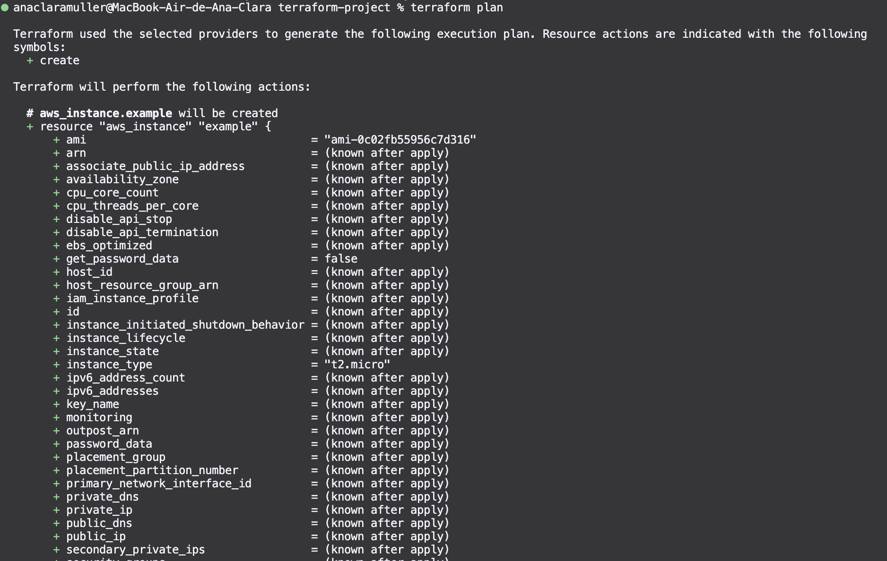
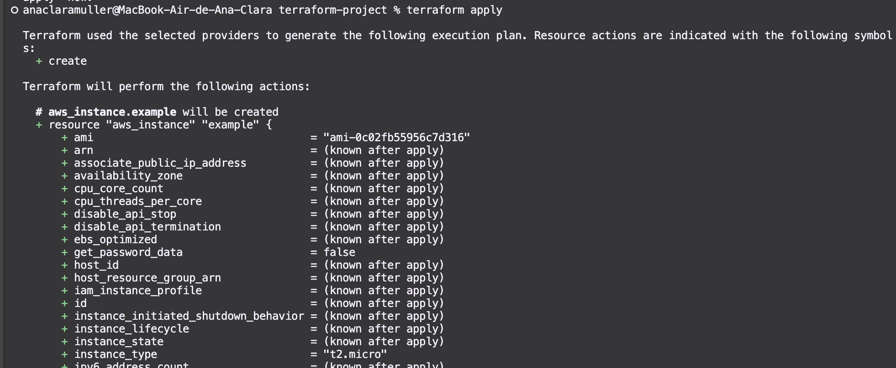
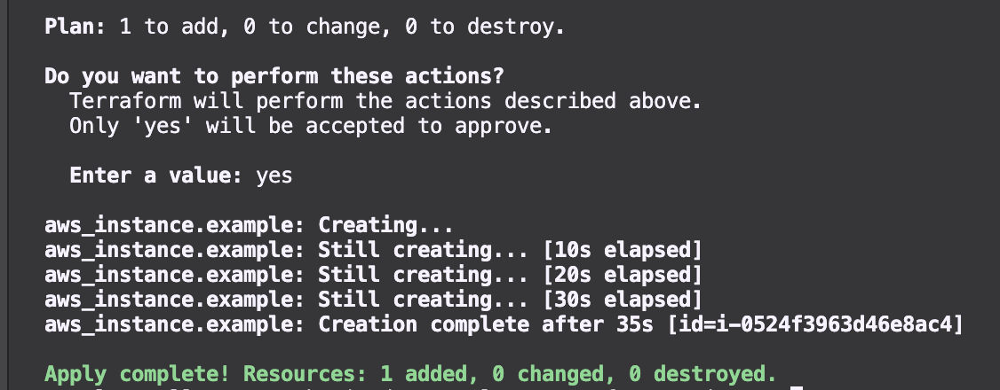
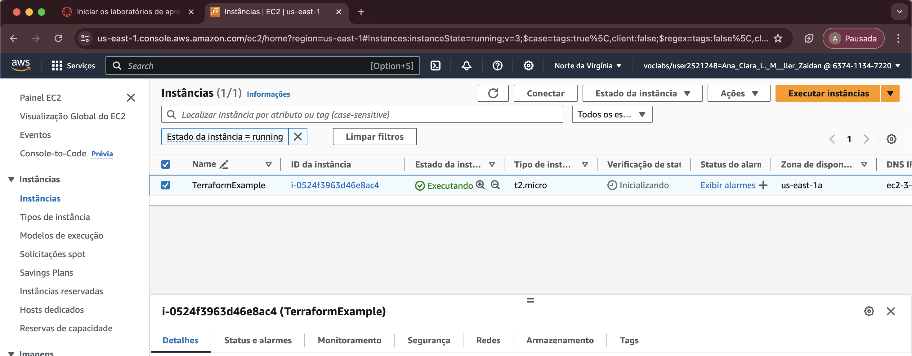
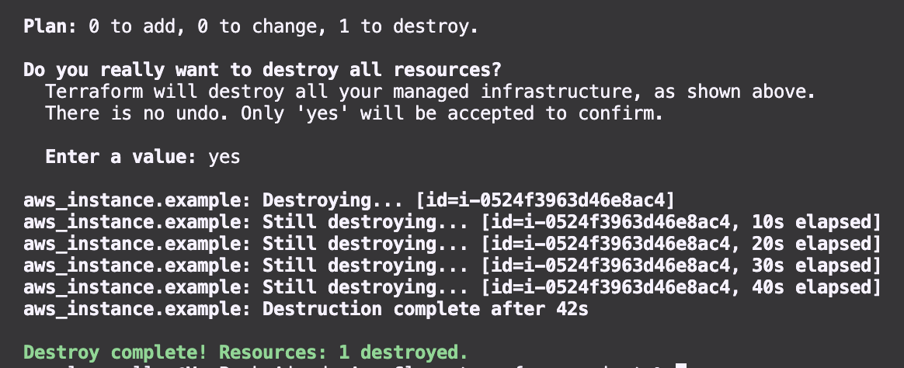
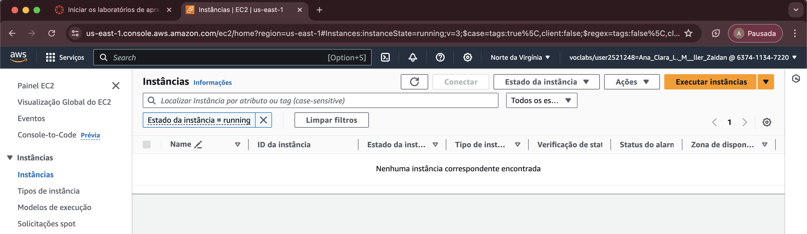
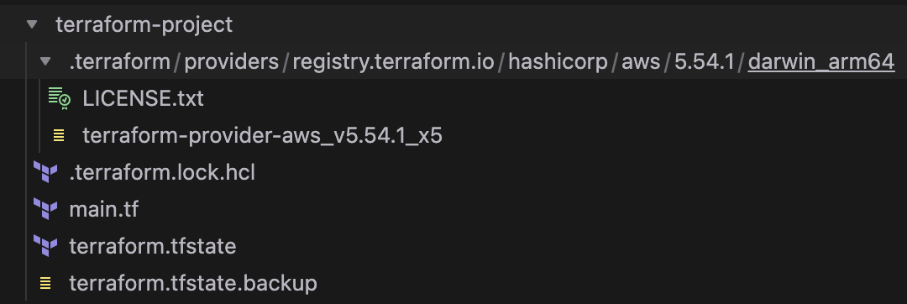

# IaC com terraform
## Tecnologias e conceitos aprendidos
- Amazon Web Services (AWS)
- Terraform
- IaC - Infraestructure as Code
- Provisionamento de recursos na AWS
- Configuração das credenciais da AWS

## Passo a passo
### 1. Pré-requisitos
1. Instalar Terraform CLI
2. Instalar AWS CLI
3. Configurar credenciais da conta da AWS na máquina (`~\.aws\credentials`)

### 2. Criação do projeto
-  Criar arquivo `main.tf` , que irá conter informações do provider (AWS), e definições dos recursos da infraestrutura - nesse caso, da instância EC2 que será criada.
-       provider "aws" {
        region = "us-east-1"
        }

        resource "aws_instance" "example" {
        ami           = "ami-0c02fb55956c7d316"  # Amazon Linux 2 AMI (HVM), SSD Volume Type
        instance_type = "t2.micro"

        tags = {
            Name = "TerraformExample"
        }
        }

### 3. Criar a pasta `.terraform` através da execução do comando:
-     terraform init
### 4. Visualizar as ações que serão realizadas através do comando:
-     terraform plan

### 5. Criar a instância EC2 na AWS, através do comando:
-       terraform apply

### 6. Verificar criação da instância no dashboard da AWS:

### 7. Destruir instância e limpar a infra, artavés do comando:
-       terraform destroy

### 8. Verificar no dashboard da AWS que a instância foi realmente deletada:

### 9. Estrutura final dos arquivos de terraform:
